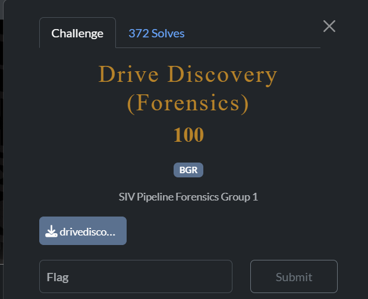
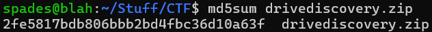
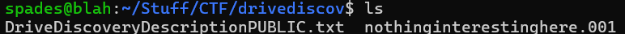
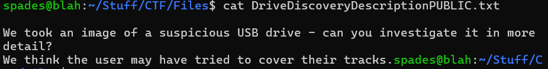
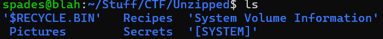
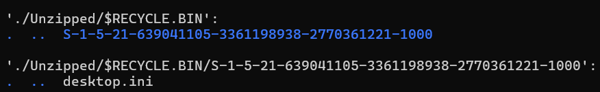
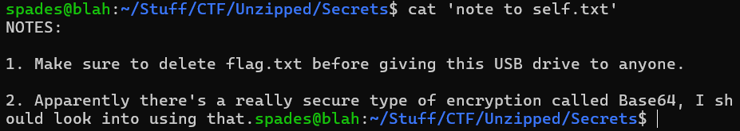
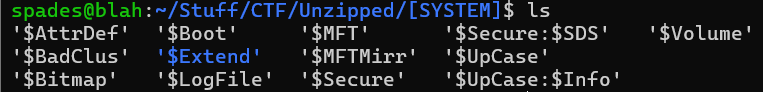
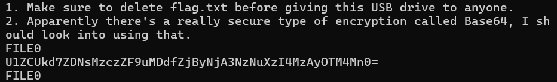

# Drive Discovery

## Description

## File

[drivediscovery.zip](drivediscovery.zip)  
MD5 Hash: 2fe5817bdb806bbb2bd4fbc36d10a63f
 

## Writeup

We first want to check our zip file's MD5 hash with `md5sum drivediscovery.zip` to ensure integrity.

Looks good!
 
 

Unzip the file with `unzip drivediscovery.zip`

 
 

The DriveDiscoveryDescriptionPUBLIC.txt suggests that the flag has likely been deleted.

 
 

The .001 file likely packed the hidden thumb drive, so we unzip it with 7zip using  `7zip x nothinginterestinghere.001`.

 
 
There are a few directories here. The `'$RECYCLE.BIN'` directory is the recycle bin. This file tells us that we are working with a windows system, as `'$RECYCLE.BIN'` is a standard system folder for windows. 

Since the flag is deleted, we can take a look in the recycle bin. There seems to only be a .ini file in here, so the flag is not here.

The `Recipies` directory contains a few cookbook recipies, but it does not contain much useful info, so it is likely a red herring. 

`'System Volume Information` contains a WPSettings.dat file, which is typically used to manage functionalities for external drives. It is largely irrelevant, so we can move on from this directory.

`Pictures` contains 3 images, which are quite literally red herrings. Here is an example of one:

 
 
The directory `Secrets` contains a hint for us: the flag is likely encoded in Base64. 

Base64 is not an encryption scheme, but rather an encoding scheme. Encryption converts data into an unreadable version of itself, and is only readable/accessible by those who have the key. On the other hand, encoding converts data into a standardized format that is readable and decodeable by anyone who understands the format. This means that as long as we can find this Base64 encoded flag, we can decode it easily to get our flag in plaintext.
 
 

The flag is deleted but is not in the recycling bin. This means the user probably deleted it from the recycling bin as well, so it will likely in the system's memory. We can access the system's memory by looking in the `'[SYSTEM]'` directory. 

 
 
There are a lot of files here, all defining parts of an NTFS (New Technoolgy File System).

The `$AttrDef` file contains a list of NTFS attributes and their numericIDs, as well as their minimum and maximum size. 

`'BadClus'` contains a list of unstable clusters, marking them as not suitable for storing data.

`'$BitMap'` tracks clusters to see if they are used or unused for storage.

`'$Boot'` contains a boot sector, which is a sector in the drive that has instructions on starting the operating system.

`'$Extend'` is a directory that contains metadata about files and directories, allowing for advanced NTFS features.

`'$LogFile'`is a transaction log that records changes made to the metadata of the file system.

`$MFTMirr` is essentially a backup copy of the first few items from the $MFT. 

`$Secure` hels store and manage security information, including access control and permissions management. 

`$Secure:$SDS`contains the security descriptors that define who has what permissions to each folder or file. 

`'$Upcase'` allows NTFS to be case-insensitive when dealing with files by storing a table of Unicode lowercase and uppercase characters. 

`'$Upcase:$Info'` is a stream of $Upcase, helping it run properly.

`'$Volume'` stores metadata about the current volume.

The `$MFT`, or Master File Table, is our main file of interest. It is a metadata file that keeps track of all files abd directories; so if the flag has been deleted, it may still be found here. 

`$MFT` has a lot of binary data, so we use `strings $MFT` to only see strings. We find a line of base64 encoded text, which is the flag encoded in base64.

Decode  with `cat $MFT | grep U1ZC | base64 -d`.  

The flag is: `SVBRG{d3l373d_n07_f0r60773n_283029382}`!

