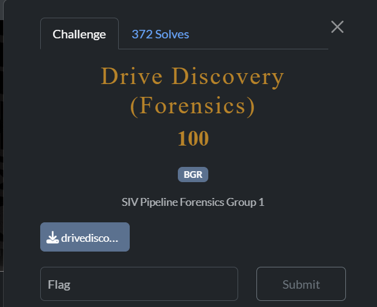
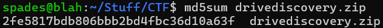
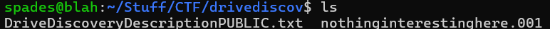
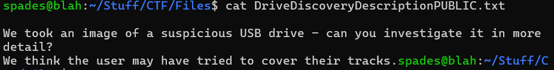
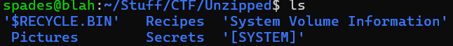
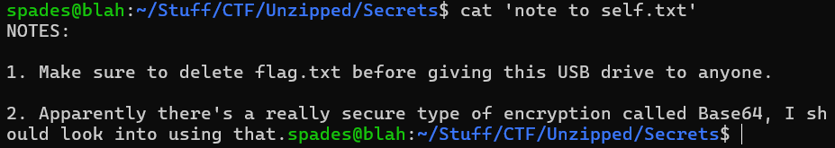
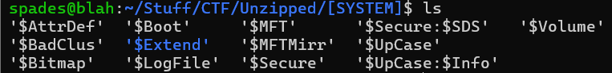
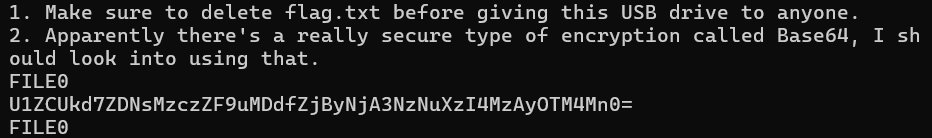

# Drive Discovery

## Description

## File

[drivediscovery.zip](drivediscovery.zip)  
MD5 Hash: 2fe5817bdb806bbb2bd4fbc36d10a63f
 

## Writeup

We first want to check our zip file's MD5 hash with `md5sum drivediscovery.zip` to ensure integrity.

Looks good!
 
 

Unzip the file with `unzip drivediscovery.zip`

 
 

The DriveDiscoveryDescriptionPUBLIC.txt suggests that the flag has likely been deleted.

 
 

The .001 file likely packed the hidden thumb drive, so we unzip it with 7zip using  `7zip x nothinginterestinghere.001`.

 
 

The directory "Secrets" contains a hint for us: the flag is likely encoded in Base64.

 
 

Since the flag has been deleted, it is likely not in the recycle bin, but instead in the '[SYSTEM]' directory. 

 
 

The $MFT, or Master File Table, file maintains records of all files, so if the flag has been deleted, it can still be found here and will be encoded in base64.  

Using `strings $MFT`, we find a line of base64 encoded text. This is the flag.

Decode  with `cat $MFT | grep U1ZC | base64 -d`.  

The flag is: `SVBRG{d3l373d_n07_f0r60773n_283029382}`!

