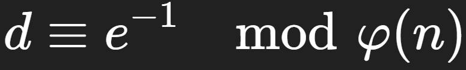

# Prime Suspects

## Description
We've recovered the following:

n = 102064367305175623005003367803963735992210717721719563218760598878897771063019 e = 65537 c = 66538583650087752653364112099322882026083260207958188191147900019851853145222

## Writeup

### Background

In RSA protocol, 5 main variables are used to calculate encrypted messages: `n, e, d, m, c`
1. `n` refers to modulus: a positive integer that is the product of two large prime numbers `p` and `q`. Used in both public and private keys. It defines a range of operations. Encryption is done through `modulo n`, meaning that answers are calculated as the remainder of a number, x, divided by n. `e.g. 101 modulo 10 = 1`.
2. `e `refers to the public key exponent, which is used in tandem with m (value of the message) to encrypt the initial message.
3. `m` is the plaintext string that needs to be encrypted.
4. `d` refers to the private key exponent. This is used in an inverted formula to decrypt a message. To calculate the private key exponent, the following formula is used:

    

5. `c` refers to the encrypted ciphertext. This is the final product after the initial plaintext message has been put through the following encryption formula:

    
 
 

### Decryption
In order to decrypt ciphertext, the following formula is used:

&nbsp;&nbsp;&nbsp;&nbsp; 
 
 

First, find value of d such that `d = e` `-1`  `mod ɸ(n)`.

The value of `ɸ(n)` can be calculated using the formula

 which equals to `102064367305175623005003367803963735991571162780082592131930680932388782111920`.
 
 

Next, we plug given variables into the aforementioned equation for calculating `d`.   
`e` and `n` are given, so plugging it into an equation, we get `d = 65537``-1``mod 102064367305175623005003367803963735991571162780082592131930680932388782111920`.   
  
We get that `d = 68912953800967717746790347823754448901033369745619340248072579325544404053473`.
 
 

With `d`, we can calculate `m` (plaintext) with the formula `m= c``d``mod n`. Plugging in what we have, we find that `m = 475771530942622400836342960890124188807255520125.`
 
 

We can convert this integer into plaintext by plugging it into an RSA translation website, and we get the flag: `SVUSCG{sm4ll_pr1m3s}`.
