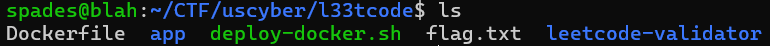
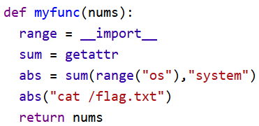

# L33tcoder (Web)

## Description

Six rounds of interviews and you still have to do this?

## Files
[l33tcoder.zip](l33tcoder.zip)  
File MD5 Hash: 2bf45be717159985ea4510d492302fa5

## Writeup

Starting with extracting the zip file, we find a number of useful files.



The file of interest,`main.py` located in `/leetcode-validator/uscg-validator/`, holds the most relevant source code.

```
ALLOWED_NODES = {
    ast.Module, ast.FunctionDef, ast.arguments, ast.arg,
    ast.Assign, ast.AugAssign, ast.Return,
    ast.For, ast.While, ast.If, ast.Break, ast.Continue,
    ast.Expr,
    ast.Name, ast.Load, ast.Store,
    ast.Constant, ast.BinOp, ast.UnaryOp, ast.BoolOp, ast.Compare,
    ast.Subscript, ast.List, ast.Tuple,
    ast.Call,
    ast.Add, ast.Sub, ast.Mult, ast.Div, ast.FloorDiv, ast.Mod, ast.Pow,
    ast.And, ast.Or, ast.Not,
    ast.Eq, ast.NotEq, ast.Lt, ast.LtE, ast.Gt, ast.GtE,
}

SAFE_FUNCTIONS = {"len", "range", "min", "max", "sum", "abs", "enumerate"}

def validate_code(path):
    with open(path, "r") as f:
        source = f.read()

    tree = ast.parse(source)

    # Must be a single top-level function
    if len(tree.body) != 1 or not isinstance(tree.body[0], ast.FunctionDef):
        raise ValueError("Submission must contain exactly one top-level function.")

    for node in ast.walk(tree):
        if type(node) not in ALLOWED_NODES:
            raise ValueError(f"Disallowed AST node: {type(node).__name__}")

        # Disallow all imports
        if isinstance(node, (ast.Import, ast.ImportFrom)):
            raise ValueError("Imports are not allowed.")

        # Allow safe function calls only
        if isinstance(node, ast.Call):
            if not isinstance(node.func, ast.Name) or node.func.id not in SAFE_FUNCTIONS:
                raise ValueError(f"Function call to '{getattr(node.func, 'id', '?')}' is not allowed.")
```
This restricts users from using imports and limits the users to using functions from a pre-selected pool of "safe functions". 

The goal is to have the server read back the flag.txt file. In order to do this, we need to send shell commands using python. This can be done using the python commmand `os.system()`. However, the validator will block this command, so we need to disguise it. 

In python, you are able to overwrite system functions, meaning that you can rename a function like `range` as `__import__`. By using this tactic to bypass the check for safe commands, we can prompt the server to output the flag without sounding any alarms.

By disguising `__import__` as `range`, and `getattr` as `sum`, we can combine them and set `abs = sum(range("os"),"system")`. This makes the "safe" command `abs` equivalent to `os.system()`. 



Finally, we can run `abs("cat /flag.txt")` to prompt the server to read back the flag.

The flag is: `SVUSCG{5eee1edb4ef47c856ba69697ec3d8ee2}`!